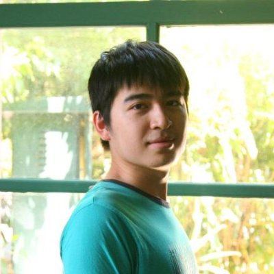

# Chih Hsuan Hsiao

##### Instructor at National Kaohsiung First University of Science and Technology & Freelancer

Taipei City, Taiwan | Computer Software
 
Previous&emsp;&emsp;Chunghwa Telecom, Netxtream Technologies
Education&emsp;&emsp;National Tsing Hua University

My name is Chih Hsuan Hsiao. I have **9 years** of programing experience and almost **5 years** of work experience about **software development**.

I have worked as a **software engineer** and a **system administrator** in **Chunghwa Telecom (CHT)** which is the largest telecom company in Taiwan and has **260 million customers** for three years. In CHT, I'm responsible for the **web system development** in several projects. I learned how to design **scalable systems** and acquired a lot of **network security** knowledge.

I started to join software development competitions since 2011 and I got several awards. The last award is the **winner** of **game development** from the **NTU hackathon** which is one of the largest hackathons in Asia at August 2016. It excited to got these awards but the most wonderful experience from those competitions was to make great stuff with those talent people I met from these competitions.

At the September 2016, Professor Chu in **National Kaohsiung First University of Science and Technology (NKFUST)** and I got the Taiwan's government grant for open the game development course in NKFUST. I also created an **open-sourced Shoot'Em UP Game (STG)** template for the course. We'll put the game into an **arcade machine** which will place in the campus. At the same time, I quit my job from CHT and became a **instructor**. Now I'm not just a taker, but also a giver.

I want to communicate with people. Instead of just having conversation, I want to create some great works which can bring people together. It's cool to see your games are played by famous youtubers and discussed by people, isn't it? 

"With great power comes great responsibility"

I believe that a coder not just write code but also make the world better. I pursue new opportunities to work with people who have the same idea.
