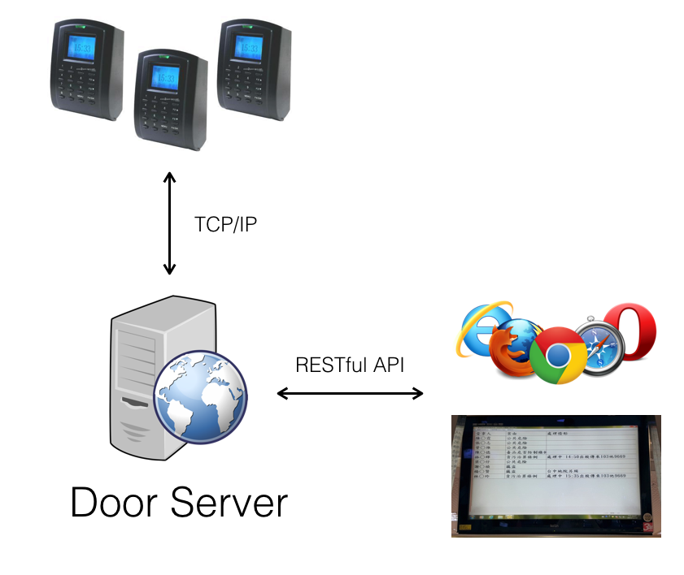
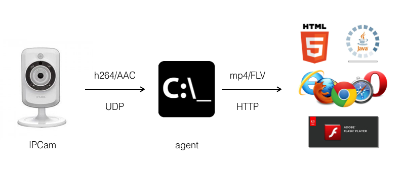

# Projects

##### Shoot'em Up
February 2016 May – now
 

##### Github

https://github.com/keviner2004/shoot-em-up
##### Video

https://youtu.be/eyVKpGKyC0o

##### Using

* Corona SDK
* Django
 
---
##### Flipper
February 2016 – March 2016
 

Flipper is a game for my ex-girlfriend. When we were dating, we prepared birthday surprise for each other every year. I have written a song and created a board game as birthday gifts for her over past two years. "Why not give her a game this year?" An idea came to my mind. 

I wanted to put our daily memories to this game. I collected our photos and put they on the desk. My chin rested on my right hand like "The Thinker" and I thought for a while. Finally, I decided to make a card matching game of two players and made these cards by our photos. The game is shown in the following video but I replace these photos with colored images because of privacy. I will always remember that day. She cried with joy and held me so tightly.

###### Using
* Corona SDK
 

---
##### Doors
July 2015 – October 2015
 

 The Doors project is a door control system which is used in National Kaohsiung First University of Science and Technology. It provides Restful API for access control like allowing someone to pass through the door.
 

###### Flow

###### Using
* Python
* Tornado
 

---
##### IPCamWeb
June 2014 – December 2014
 

IPCamWeb is a solution which allows users to watch raw h.264 and aac streams from IP cameras on web browsers directly. It is used by an IP camera provider in Taiwan.
###### Flow

 
* Python
* FFmpeg
* C
* Flex
 

---

##### Dr. Elly
March 2013 - now
 
###### How was Dr. Elly Started?

In order to get the ticket of the worldwide final, we started to develop a new game by redesigning Fantasia with new graphics, stories and a new upgrade system. The new game is called Dr. Elly and it's gameplay is almost the same as Fantasia. 

###### Better Graphics

Dr. Elly has better graphics than Fantasia. Theses monsters in each level become more vivid. For example, they will be angry when their health point is low and be sad when they are dying. These monsters' attacks are more real too, so these players may feel hurt when they are attacked by these monsters. The new UX design was also introduced. The game had more attractive start screen and it also used the human body as the level map to be consistent with the game topic.

###### New Story

Dr. Elly's mom was infected by evil viruses. She asked her assistant named Mr. David's for help to shrink herself so that she could enter her mom's body to defeat these viruses directly. The game also provided 10 levels with different monsters and original songs.

###### Upgrading System

After defeating these monsters in each level, they will drop materials which can be used for upgrading Elly's ability. By using those material, Elly's attacks become more powerful so that the monster will get more damage when player hit these falling objects, and the health points is increased so that Elly can endure more attacks from these monsters. Player can also upgrade Elly's special skills to make those skills be more powerful and effective.

Even if we eventually failed to get into worldwide final, it was a tremendous experience about game developing. So far, we still developing other Dr. Elly games.

##### Videos

https://youtu.be/nAICYBWoh2U



https://youtu.be/LEt7jW48uMY



https://youtu.be/e87pamULJeU


##### Using
* We use **Unity3D** to develop Fantasia and Dr. Elly. 
* In order to generate music rhythm game levels in Dr. Elly rhythm game, I use **Python** to translate **midi** files to the game levels.
* Our original song is made by **Reason**.
* The magic multiplayer mode of Fantasia and Dr. Elly is implemented via **UDP**.
 

